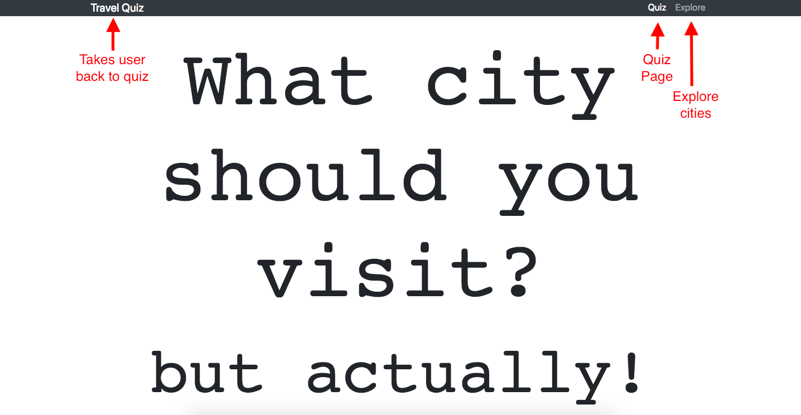
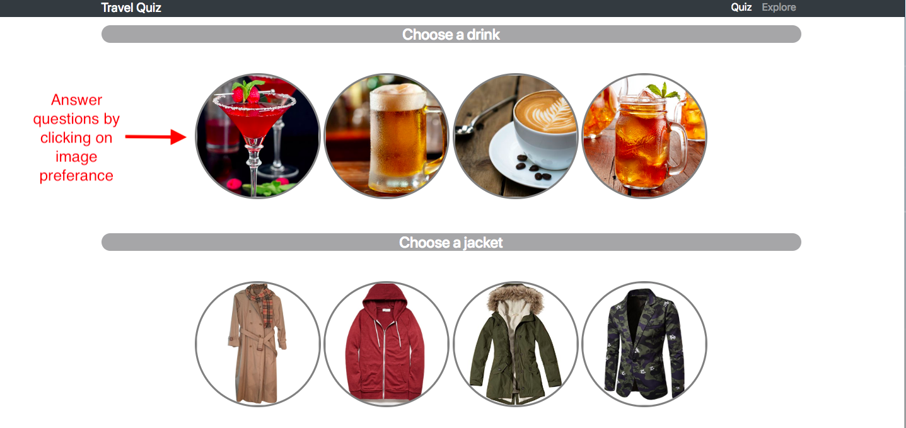
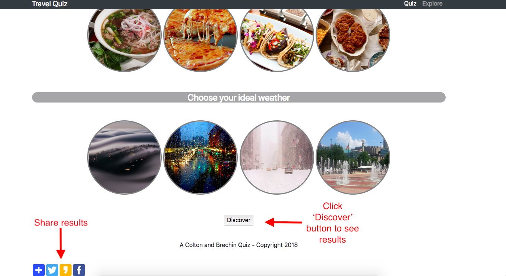
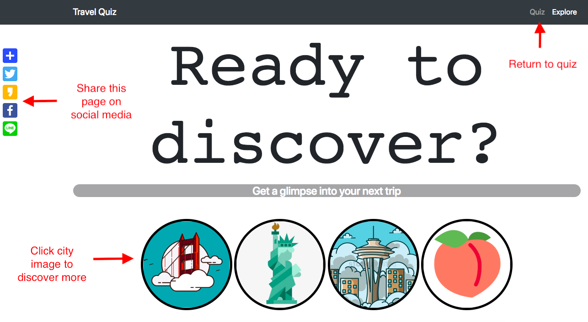
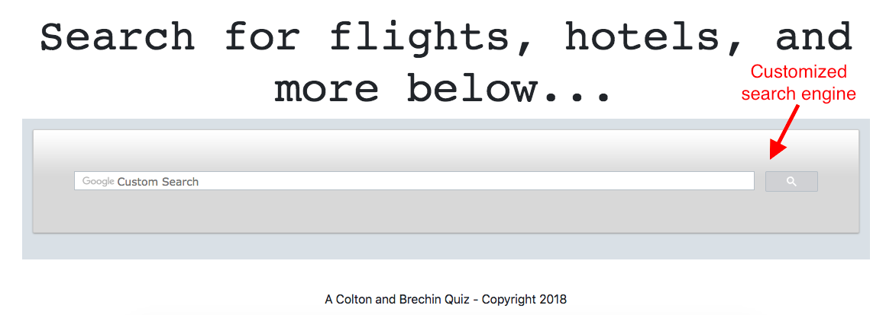

Quiz: Where should you travel?
======================
Deployed URL: https://brechy.net

Quiz abstract. Take the quiz and it will output a suggested city you should visit.

## Description
Answer the questions and press the 'Discover' button at the bottom of the page. The computer will then generate a suggested travel destination. Click the 'Explore' option on the navbar on the top of the page. From the second page, you can begin to explore the four different cities that could be suggested in the previous quiz. Clicking on one of the four buttons will redirect you to that specific city's tourism related website. Use the custom search bar at the bottom of the page to pull information on flights, hotels, and activities. Finally, share the quiz or website on social media using the provided floating bank of social media buttons.

## User Experience

Navbar navigation:

Quiz button usage:

Submit quiz and social media sharing:

Page two usage/navigation:

Page two custom search bar:

## Installation
Install phantomJS:

Install casperJS:    

Run headless browser tests:

## Skills Applied:
HTML, CSS, JavaScript, Google API, Bootstrap CSS Framework

## Technical Requirements
For the Q1 Front-end Project, at Galvanize Web Development Immersive the following requirements were given.
 - Use HTML, CSS, and JavaScript.
 - Use a CSS Framework like Bootstrap or Materialize.
 - Separate your HTML, CSS, and JavaScript into multiple files.
 - Organize your code with functions.
 - Must be interactive website / accepts user inputs.

## Future
In the future, I would like to add these functions depending on necessity:
  - Implement local storage to save a user's quiz progress so they can return to it later to complete.
  - Create progress bar to track user's quiz progress in real time.
  - Clean or refactor any code where necessary.
  - Add a monetization feature that provides affiliate links or booking buttons (in the quiz result window) to flights and/or hotels specific to quiz results.
  - Refactor or rewrite a more mobile friendly version.

## Contribution
Colton Berger,
Corina Andariese,
Add To Any,
Sweet Alert,
Galvanize G88
